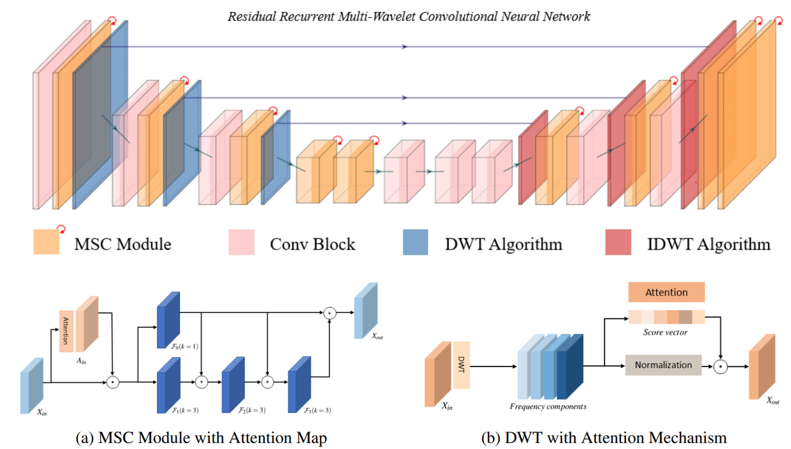
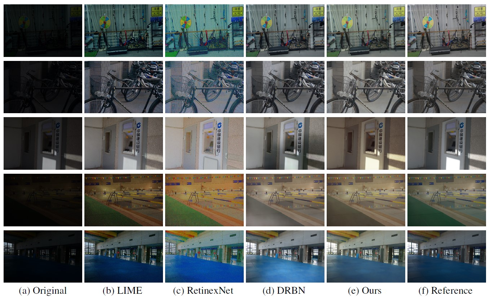

# Low-Light Image Enhancement\\ in the Frequency Domain

<p align="center">
  <br>
  <a href="https://chqwer2.github.io/" target="_blank">Hao Chen*</a>,&nbsp;
  Zhi Jin<sup>&#x2709;
  <br>
  S-Lab, Sun Yat-sen University
  <br>
  <sup>&#x2709;</sup> Corresponding Author
</p>




[arXiv](https://arxiv.org/abs/2307.08699)

## Abstract

Decreased visibility, intensive noise, and biased color are the common problems existing in low-light images. These visual disturbances further reduce the performance of high-level vision tasks, such as object detection, and tracking. To address this issue, some image enhancement methods have been proposed to increase the image contrast. However, most of them are implemented only in the spatial domain, which can be severely influenced by noise signals while enhancing. Hence, in this work, we propose a novel residual recurrent multi-wavelet convolutional neural network R2-MWCNN learned in the frequency domain that can simultaneously increase the image contrast and reduce noise signals well. This end-to-end trainable network utilizes a multi-level discrete wavelet transform to divide input feature maps into distinct frequencies, resulting in a better denoise impact. A channel-wise loss function is proposed to correct the color distortion for more realistic results. Extensive experiments demonstrate that our proposed R2-MWCNN outperforms the state-of-the-art methods quantitively and qualitatively.  
## Codebase Structure

### Data Preparation

LOw Light paired dataset (LOL): [Google Drive](https://drive.google.com/open?id=157bjO1_cFuSd0HWDUuAmcHRJDVyWpOxB), [Baidu Pan (Code:acp3)](https://pan.baidu.com/s/1ABMrDjBTeHIJGlOFIeP1IQ)

You can also download them from the official [website](https://daooshee.github.io/BMVC2018website).


</details>

### Environment Setup

We recommend using Anaconda to set up the environment:

<details>
  <summary>Click to expand/collapse</summary>

``` bash
conda install pytorch==1.7.1 torchvision pytorch-cuda=11.0 -c pytorch -c nvidia -y
```

</details>


### Training

```bash
#single GPU
PYTHONPATH='.':$PYTHONPATH python train.py
```

### Testing
The model weight can be downloaded [here](https://drive.google.com/file/d/19dIWQIoda-52tcooPYpThiSCSwIf3nmA/view?usp=sharing) and put into "./model".
```bash
PYTHONPATH='.':$PYTHONPATH python test.py

```

### Results




## Citation
If you find our repository useful for your research, please consider citing our paper:
```bibtex
@misc{chen2023lowlight,
      title={Low-Light Enhancement in the Frequency Domain}, 
      author={Hao Chen and Zhi Jin},
      year={2023},
      eprint={2306.16782},
      archivePrefix={arXiv},
      primaryClass={cs.CV}
}
```
